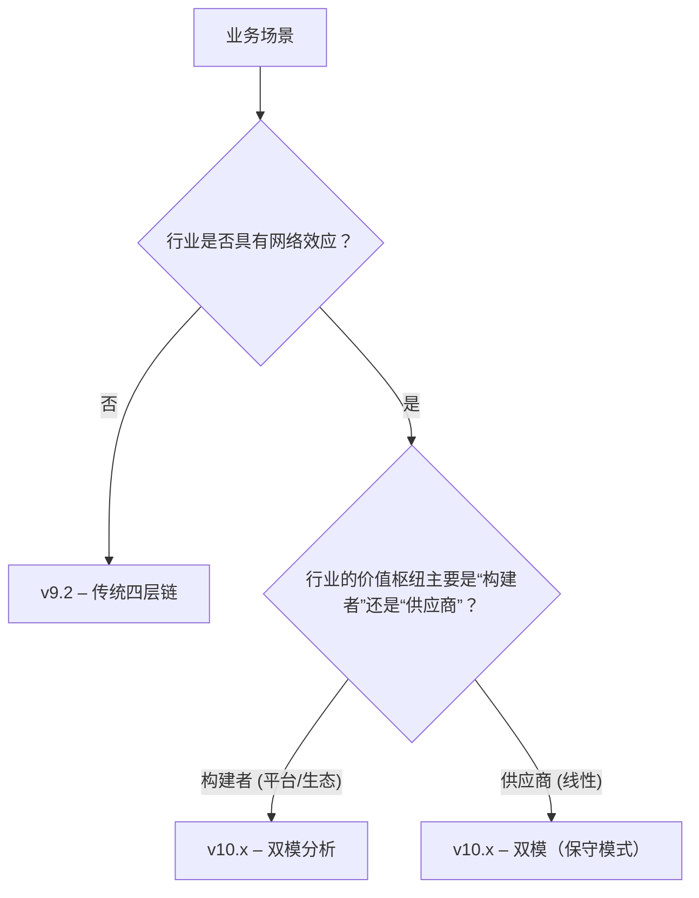

# 版本选择指南

本指南帮助分析师在 **行业链分析** 时快速决定使用哪个框架版本（**v9.2** 传统四层链或 **v10.x** 双模链+价值网）。

## 📊 决策树（简化版）

### 关键判断标准
| 判断项 | 说明 | 对应版本 |
|--------|------|----------|
| **网络效应** | 是否有用户规模、平台交易额、生态合作等显著的二次增长因素？ | 有 → v10.x；无 → v9.2 |
| **价值枢纽属性** | 枢纽是 **平台/建网者**（提供公共资源、网络）还是 **传统供应链环节**（原材料、加工）？ | 建网者 → v10.x；传统 → v9.2（或 v10.x 的保守模式） |
| **数据可得性** | 是否能获取平台活跃用户、DAU、交易额等网络指标？ | 能 → v10.x；不能 → v9.2 |
| **分析深度需求** | 只需判定价值池、利润点 → v9.2；需要评估网络协同、平台生态价值 → v10.x |

## 🚀 使用示例

### 1. 传统制造业（例如 **重型装备**）
- **网络效应**：基本无
- **价值枢纽**：上游材料供应、核心品牌
- **推荐版本**：`v9.2`

### 2. 互联网内容平台（例如 **短视频**）
- **网络效应**：显著（用户规模、内容产出）
- **价值枢纽**：平台建网者、内容创作者生态
- **推荐版本**：`v10.x`

### 3. 金融科技（如 **支付平台**）
- **网络效应**：强（交易网络）
- **价值枢纽**：支付网络建构者 + 关键银行合作伙伴
- **推荐版本**：`v10.x`

## 📚 关联文档
- `theory/v9.2/framework.md` – 传统四层链模型
- `theory/v10.x/v10.5.1.md` – 双模框架细节
- `docs/design/architecture.md` – 整体架构说明

---

> **最佳实践**：
> - 在每个案例的 **YAML 头** 中标明 `version`（如 `v9.2` 或 `v10.x`），CI 会自动校验。
> - 若同一行业出现 **平台化转型**（例如传统零售转为线上平台），可在同一案例中 **双版本** 对比，帮助展示框架演进的价值。
